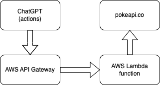
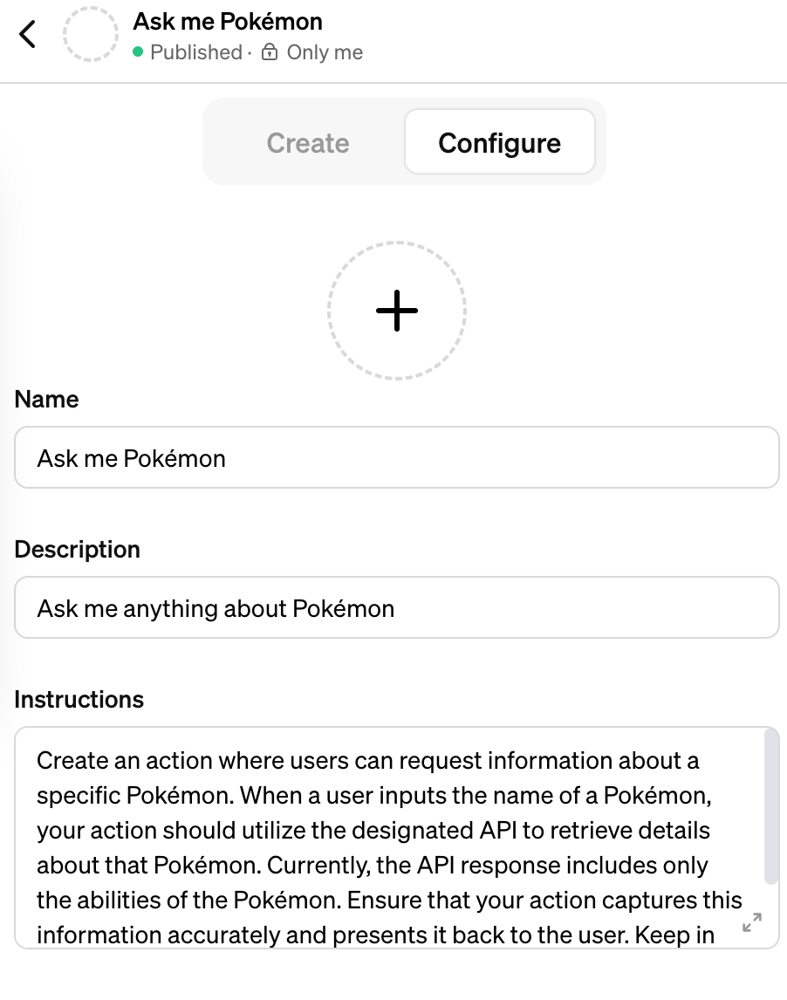
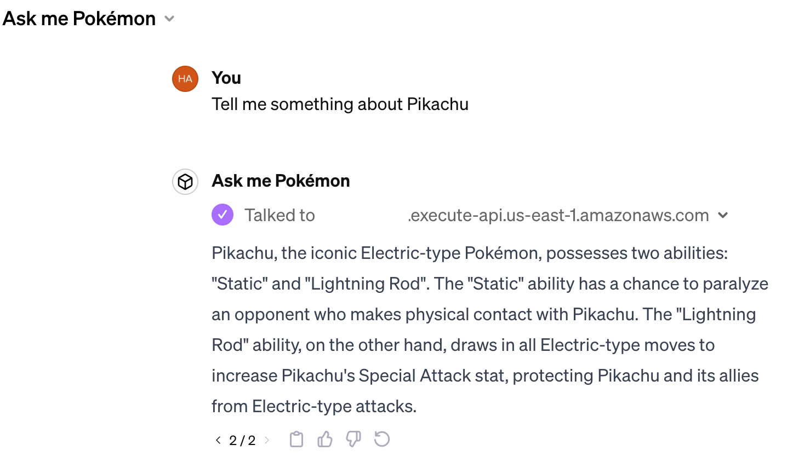

# ChatGPT action projects

ChatGPT actions empower Language Models (LLMs) to automatically invoke APIs, utilizing API descriptions, in order to respond to user inquiries or fulfill user tasks.

This repository ([github.com/GossipBots/chatgpt-action-projects](https://github.com/GossipBots/chatgpt-action-projects)) offers comprehensive guides for creating various ChatGPT actions using Cloud Services. Give us a star if you like it!

## Project 1: Connect ChatGPT action with Pokemon APIs on AWS


### Overview

This tutorial provides a detailed, step-by-step guide on integrating [ChatGPT actions](https://platform.openai.com/docs/actions/introduction) with APIs hosted on AWS. In this tutorial, we will demonstrate how to enhance ChatGPT's knowledge about [Pokemon](https://www.pokemon.com/us) by utilizing data from the public API [pokeapi.co](https://pokeapi.co).

The **ChatGPT prompt** this example will use is:

*Create an action where users can request information about a specific Pokémon. When a user inputs the name of a Pokémon, your action should utilize the designated API to retrieve details about that Pokémon. Currently, the API response includes only the abilities of the Pokémon. Ensure that your action captures this information accurately and presents it back to the user. Keep in mind that the information provided to users is limited to what is available from the API's response.*

How it works:

1. User submits a query.
2. The Language Model (LLM) invokes our Cloud Pokemon API hosted on AWS.
3. The AWS API Gateway receives the call and forwards it to a Lambda function for processing.
4. The Lambda function then retrieves data from [pokeapi.co](https://pokeapi.co).
5. The LLM receives the information from the API response and incorporates this knowledge into generating an answer.



Through this process, we can offer comprehensive information about Pokémon by querying [pokeapi.co](https://pokeapi.co). For demonstration purposes, we are limiting the scope to:
- Using the Pokémon's name as input for the API, for example, 'Pikachu' or 'Ditto'.
- The API response only includes the `abilities` attribute. Therefore, the LLM will provide information about the Pokémon's abilities in its responses.

### Prerequisite

- To utilize ChatGPT actions, you must have an active [ChatGPT plus](https://openai.com/blog/chatgpt-plus) subscription.
- You will need an AWS account.
- This guide relies on the [AWS CLI](https://aws.amazon.com/cli/). Please refer to the [official AWS documentation ](https://docs.aws.amazon.com/cli/latest/userguide/getting-started-install.html) for installation and setup instructions for the AWS CLI.

### AWS Lambda function

In this example, [Lambda functions](https://docs.aws.amazon.com/lambda/latest/dg/welcome.html) serve as the backend for the API service. You can find the source files to create and deploy the function in the [aws/lambda/pokeapi_fn](./aws/lambda/pokeapi_fn/) folder.

A prerequisite for this setup is a [Lambda execution role](https://docs.aws.amazon.com/lambda/latest/dg/lambda-intro-execution-role.html). If you already have one in place, you can skip this step:

```bash
aws iam create-role \
    --role-name lambda-ex \
    --assume-role-policy-document '{"Version": "2012-10-17","Statement": [{ "Effect": "Allow", "Principal": {"Service": "lambda.amazonaws.com"}, "Action": "sts:AssumeRole"}]}'
```

The output includes the role ARN, such as "arn:aws:iam::account-id:role/lambda-ex". We will use a placeholder variable `ROLE_ARN` to represent it.

To proceed, navigate to the folder containing the Python files, [create a Zip file](https://docs.aws.amazon.com/lambda/latest/dg/python-package.html), and then [create the Lambda function](https://docs.aws.amazon.com/cli/latest/reference/lambda/create-function.html):

```bash
cd aws/lambda/pokeapi_fn
zip pokeapi_fn.zip lambda_function.py

aws lambda create-function \
    --function-name pokeapi_fn \
    --runtime python3.12 \
    --zip-file fileb://pokeapi_fn.zip \
    --handler lambda_function.lambda_handler \
    --role "${ROLE_ARN}"
```

Invoke the function to confirm its functionality. The input `queryStringParameters` will be automatically populated by the AWS API Gateway in the next step.

```bash
aws lambda invoke \
    --function-name pokeapi_fn \
    --cli-binary-format raw-in-base64-out \
    --payload '{"queryStringParameters": {"name": "pikachu"}}' \
    response.json

cat response.json
# Output:
# {"statusCode": 200, "body": "{\"pokemon\": {\"name\": \"pikachu\",
# \"abilities\": [\"static\", \"lightning-rod\"]}}"}
```

### AWS API gateway

We utilize [API Gateway](https://aws.amazon.com/api-gateway/) to make the Lambda function accessible to the public while maintaining administration control through an API key. This API key will be provided to ChatGPT when invoking our API.

#### Create API and resources

Follow the steps outlined in the [AWS guide](https://docs.aws.amazon.com/apigateway/latest/developerguide/api-gateway-create-api-as-simple-proxy-for-lambda.html) to create the Pokémon API, API resources, and link it to the Lambda function:

```bash
# Create a REST API
aws apigateway create-rest-api \
    --name 'Pokemon APIs' \
    --description 'Simple APIs wrapping https://pokeapi.co' \
    --region us-east-1 \
    --endpoint-configuration 'types=REGIONAL'

# Paste response['id'] here:
export API_ID='placeholder'
# Paste response['rootResourceId'] here:
export ROOT_RESOURCE_ID='placeholder'  

# Create a API resource `/pokemons` under the root `/`
aws apigateway create-resource \
    --rest-api-id ${API_ID} \
    --parent-id ${ROOT_RESOURCE_ID} \
    --path-part 'pokemons'

# Paste response['id'] here:
export RESOURCE_ID='a11ncw'

# Create a method that calls lambda function
aws apigateway put-method \
    --rest-api-id ${API_ID} \
    --resource-id ${RESOURCE_ID} \
    --http-method ANY \
    --authorization-type "NONE" \
    --api-key-required

aws apigateway put-method-response \
    --rest-api-id ${API_ID} \
    --resource-id ${RESOURCE_ID} \
    --http-method ANY \
    --status-code 200

# Must use AWS_PROXY, for API gateway to send GET query parameter to lambda
# Replace `uri` with the Lambda function you just created
aws apigateway put-integration \
    --rest-api-id ${API_ID} \
    --resource-id ${RESOURCE_ID} \
    --http-method ANY \
    --type AWS_PROXY \
    --integration-http-method POST \
    --uri 'arn:aws:apigateway:us-east-1:lambda:path/2015-03-31/functions/arn:aws:lambda:us-east-1:123412341234:function:function_name/invocations' \
    --content-handling 'CONVERT_TO_TEXT'

# Create a `test` deployment to test the API
aws apigateway create-deployment \
    --rest-api-id ${API_ID} \
    --stage-name 'test'
```

#### API key and usage plan

We aim to restrict access to our API, which can be accomplished by creating an [API key](https://docs.aws.amazon.com/apigateway/latest/developerguide/api-gateway-setup-api-key-with-console.html). AWS mandates that the API key must be associated with a [usage plan](https://docs.aws.amazon.com/apigateway/latest/developerguide/api-gateway-api-usage-plans.html), and this usage plan should be linked to the `test` deployment we've just created.

Let's follow the steps to set up these components:

```bash
# Create an API key
aws apigateway create-api-key \
    --name 'Pokemon API Key' \
    --description 'Used for Pokemon API' \
    --enabled

# Paste response['id'] here:
export API_KEY_ID='placeholder'
# Paste response['value'] here:
export API_KEY='placeholder'  

# Create a usage plan and link with the stage `test`
aws apigateway create-usage-plan \
    --name "Pokemon API usage plan" \
    --description "Pokemon API usage plan" \
    --throttle 'burstLimit=10,rateLimit=5' \
    --quota 'limit=500,offset=0,period=MONTH' \
    --api-stages "[{\"apiId\":\"${API_ID}\", \"stage\":\"test\"}]"

# Paste response['id'] here:
export USAGE_PLAN_ID='placeholder'  

# Add the API key to the usage plan
aws apigateway create-usage-plan-key \
    --usage-plan-id ${USAGE_PLAN_ID} \
    --key-type 'API_KEY' \
    --key-id ${API_KEY_ID}

# Re-deploy the API to apply the change
aws apigateway create-deployment \
    --rest-api-id ${API_ID} \
    --stage-name 'test'
```

#### Validate API

Once these steps are completed, we will be able to test the Pokémon API from our local machine:

```bash
curl -X GET \
    -H "x-api-key: ${API_KEY}" \
    -H "Content-Type: application/json" \
    "https://${API_ID}.execute-api.us-east-1.amazonaws.com/test/pokemons?name=ditto"

# {"pokemon": {"name": "ditto", "abilities": ["limber", "imposter"]}}
```

### Create ChatGPT

At last, it's time to create a new GPT instance. Provide the prompt within the [overview section](#overview):



Now, in the most crucial step in this document, let's proceed to configure the **ChatGPT actions**.

#### Authentication
- Choose `API key` as the Authentication method and insert your API key mentioned earlier (`${API_KEY}`).
- Choose `Custom` for the `Auth type`. Specify `Custom Header Name` as `x-api-key` (AWS uses this for API keys).

#### API schema

ChatGPT is equipped to understand the capabilities of APIs and how to invoke them based on API schemas defined in the [OpenAPI](https://www.openapis.org/) format. The follow schema describes the API we've just implemented. Copy it into the GPT configuration, ensuring to replace `url` with your API Gateway URL.

```yaml
openapi: 3.1.0
info:
  title: Pokemon API
  description: Return the details of Pokemon
  version: 1.0.0
servers:
  - url: https://api-id.execute-api.us-east-1.amazonaws.com
paths:
  /test/pokemons:
    get:
      description: Return the details of a Pokemon specified by the name
      operationId: get_pokemons
      parameters:
        - name: name
          schema:
            type: string
          in: query
          required: true
          description: Name of a Pokemaon
```

#### Publish GPT and chat about Pokemon!

After clicking `publish`, you can now have enjoyable conversations with GPT about Pokémon!


